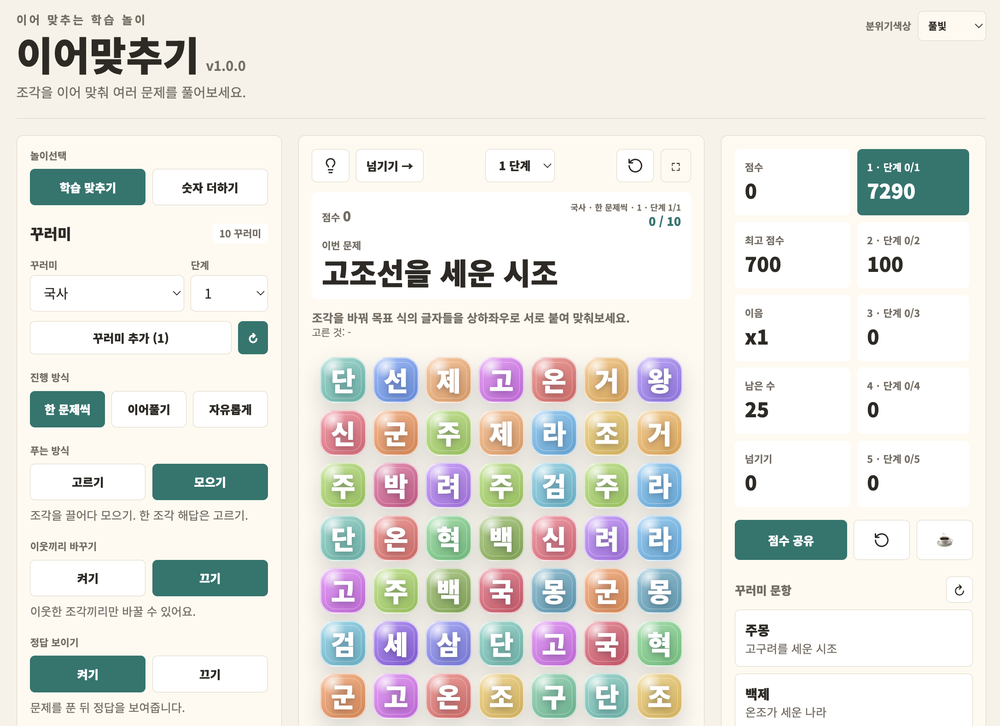
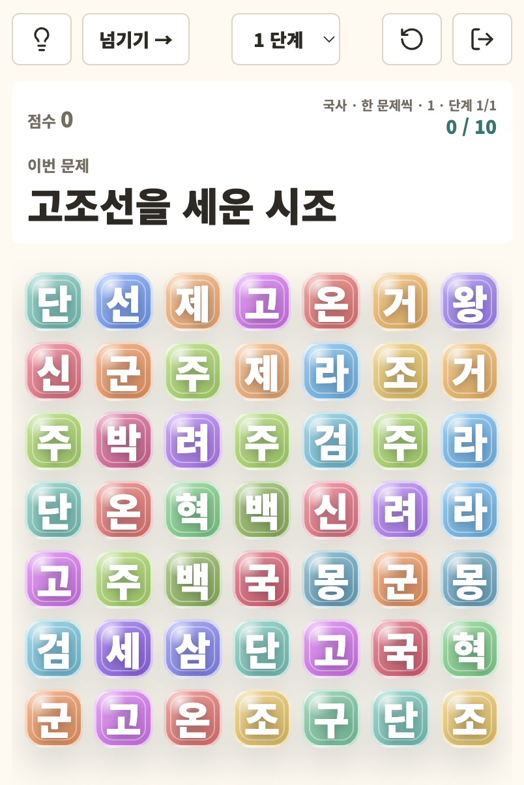
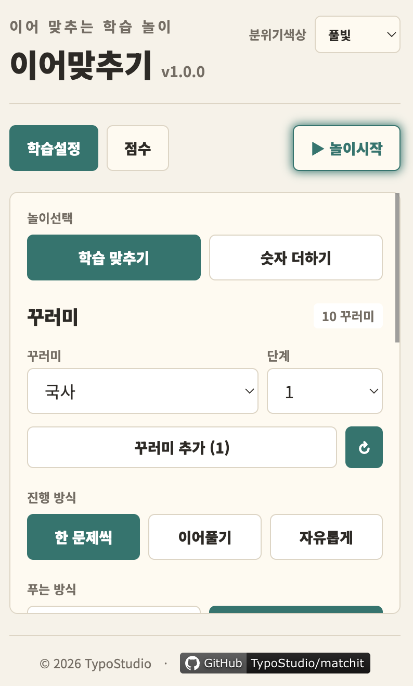

# 이어맞추기

[](https://github.com/TypoStudio/matchit)
[](https://typostudio.github.io/matchit/)
[](https://github.com/TypoStudio/matchit/stargazers)
[](https://github.com/TypoStudio/matchit/commits)  


배움거리를 조각 퍼즐로 바꿔 푸는 Vue 3 + TypeScript + Tailwind CSS 정적 게임입니다.

- 🎮 **놀러가기**: https://typostudio.github.io/matchit/  
- 📦 **배움꾸러미 저장소**: https://github.com/TypoStudio/matchit-packs/  
- 꾸러미 목록: https://typostudio.github.io/matchit-packs/packs.json  

## 스크린샷



| 모바일 — 설정 | 모바일 — 놀이 |
| --- | --- |
|  |  |

## 게임 소개

**이어맞추기** 는 한자·영어단어·수학 공식 같은 배움거리를 **조각 퍼즐**로 바꿔 푸는 게임입니다. 문제가 주어지면 판 위의 조각을 움직여 **정답을 이루는 글자·기호 조각을 맞춰 없앱니다**. 배움꾸러미만 갈아끼우면 어떤 과목이든 같은 규칙으로 즐길 수 있습니다.

두 가지 놀이가 있습니다.

- **배움 맞추기** — 꾸러미 문제의 정답 조각을 맞춰 없애는 기본 놀이.
- **수 더하기** — 같은 수를 합쳐 더 큰 수를 만드는 2048식 퍼즐.

## 노는 법 (배움 맞추기)

1. **배움꾸러미**와 **단계**(급수·학년·과목 등)를 고릅니다.
2. 화면 위 **이번 문제** 에 풀 거리가 보입니다. (길면 좌우로 흐르고, 손으로 끌어 넘길 수 있습니다.)
3. **푸는 방식**을 고릅니다.
   - **고르기** — 정답을 이루는 조각을 순서 상관없이 하나씩 톡.
   - **모으기** — 조각을 끌어다(또는 두 조각 골라) 정답 글자들을 판에서 서로 붙여 완성. 한 글자 정답은 그 조각을 톡.
4. 정답을 완성하면 조각이 사라지고 위 조각이 내려오며 새 조각이 채워집니다. **이어서 풀면 이음 점수**가 올라갑니다.

**진행 방식**

- **한 문제씩** — 한 문제를 풀고 다음 문제로.
- **이어풀기** — 여러 문제가 이어진 판에서 만들 수 있는 답을 계속 풀이.
- **자유롭게** — 이동 제한 없이 마음껏.

**그 밖의 규칙·설정**

- **마당(스테이지)** — 한 단계는 문제 10개씩 묶음으로 나뉩니다. 문제 순서는 무작위로 섞여 기기에 저장되어, 다시 시작해도 같은 순서로 이어집니다.
- **보여주기(양방향 꾸러미)** — 단어 꾸러미는 뜻↔철자, 한자는 한자↔훈음처럼 방향을 바꿔 풀 수 있습니다.
- **귀띔·정답 보이기·이웃끼리 바꾸기·판 크기·조각 꾸밈·빛깔(종이/밤/풀빛)** 을 설정에서 조절.

## 수 더하기

판 위의 수 조각을 합쳐 더 큰 수를 만드는 퍼즐입니다. 설정의 **합치기 방식**으로 고릅니다.

- **조각 바꾸기** — 조각을 바꿔 같은 수 **3개 이상**을 상하좌우로 붙이면 합쳐집니다 (2+2+2 = 6). 이어서 합칠수록 이음 점수가 오르고, 더 합칠 수 없으면 끝.
- **조각 더하기** — 한 조각을 다른 조각에 **끌어다(또는 두 조각 골라)** 더해 두 수의 합으로 만듭니다. 더한 뒤에도 같은 수가 3개 이상이면 저절로 합쳐집니다.

## 기능 요약

- **배움꾸러미 목록**: 시작 시 별도 저장소([matchit-packs](https://github.com/TypoStudio/matchit-packs))의 `packs.json` 목록을 불러옴 (한자·영어단어·영문법·국어·과학·수학·역사 등)
- **무작위 문제 순서**: 단계 문제를 섞고 그 순서를 기기에 저장해 다시 켜도 복원
- **꾸러미별 화면 구성**: 메타로 판 크기·조각 꾸밈·넓은 조각을 꾸러미마다 지정(하드코딩 없음)
- **꾸러미 더하기**: 바깥 꾸러미 주소(URL)를 더하거나 빼기(목록은 기기에만 저장)
- **내 기록 지우기**: 진행·순서·설정을 한 번에 비우기
- 빛깔 바꾸기, 점수 그림(PNG) 나누기, 모바일 전체화면 놀이

> 화면 라벨은 **언어팩 외부 파일** `src/locales/ko.json` 에 모여 있습니다. 새 언어는 같은 키로 `xx.json` 을 추가하고 `src/locales/index.ts` 의 `messages` 에 등록한 뒤 `locale` 값만 바꾸면 됩니다.

## 실행 / 빌드

```bash
npm install
npm run dev      # 개발 서버 (http://localhost:5174)
npm run build    # dist/ 정적 산출물
```

`dist`를 GitHub Pages 등 정적 호스팅에 올립니다. 배포 시 base는 `/matchit/`(프로덕션), 개발 시 `/`.

## 학습팩 로딩 구조

학습팩은 게임 본체와 분리된 **[matchit-packs](https://github.com/TypoStudio/matchit-packs)** 저장소에서 서빙됩니다.

- 기본 카탈로그 URL: 프로덕션은 `https://typostudio.github.io/matchit-packs/packs.json`, 로컬 개발은 같은 저장소의 `packs/packs.json`([src/App.vue](src/App.vue)의 `PACK_CATALOG_URL`).
- 화면의 **추가팩 관리**에서 다른 팩/카탈로그 JSON URL을 더할 수 있고, 그 목록은 `localStorage`(`matchit-extra-packs`)에만 저장됩니다.
- 표시 순서: **추가팩 → 기본팩**, 각 그룹 이름 가나다순.

### 카탈로그 `packs.json`

이름·URL·레벨수만 가지는 포인터 목록입니다.

```json
[
  { "name": "한자능력시험", "url": "language/hanja-grade/pack.json", "levels": 16 }
]
```

### 개별 팩 `pack.json`

**단일 파일형**(모든 레벨 인라인) 또는 **메타 + 레벨파일형**(각 레벨이 외부 파일 참조) 둘 다 인식합니다.

```jsonc
// 메타 + 레벨파일형: levels는 {level, label, file} 객체 배열
{ "id": "hanja-grade", "title": "한자능력시험", "accent": "#dc2626",
  "bidirectional": true,
  "directions": { "asis": "한자 → 훈음", "reverse": "훈음 → 한자" },
  "board": { "cols": 5, "rows": 5 },
  "blockStyle": "card",
  "levels": [ { "level": 1, "label": "8급", "file": "./1.json" } ] }
```

레벨 파일(`{level}.json`)은 문항(`LessonItem`) 배열입니다.

```json
[
  { "id": "water", "label": "물", "prompt": "물 만들기", "tokens": ["H","H","O"], "hint": "H2O" }
]
```

### 팩 메타 필드

| 필드 | 설명 |
| --- | --- |
| `id` / `title` / `accent` | 식별자 / 표시 이름 / 강조색 |
| `format` | `"word"`(단어팩 `word`/`meaning`/`hint`) 또는 `"lesson"`(LessonItem). 생략 시 자동 판별 |
| `bidirectional` | `true`면 출제 방향 토글 노출. lesson 팩 역방향은 답↔문제를 뒤집음. 단어팩은 자동 양방향 |
| `directions` | 방향 버튼 라벨 `{ "asis": "...", "reverse": "..." }`(lesson 양방향용) |
| `board` | 기본 보드 사이즈 `{ "cols": n, "rows": n }`(미지정 7×7). 모으기 모드는 토큰 길이 ≤ 보드 한 변 |
| `wide` | `true`면 가로로 긴 블럭(토큰이 긴 팩) |
| `blockStyle` | 기본 블럭 디자인 `jelly`/`card`/`tile`/`transparent` |
| `random` | `true`면 보드를 정답 유도 없이 완전 무작위로 채움(모으기형) |
| `levels` | `[{level,label,items}]`(단일 파일) 또는 `[{level,label,file}]`(레벨파일) |

> 전체 학습팩 목록·작성·배포 상세는 [matchit-packs 저장소](https://github.com/TypoStudio/matchit-packs#readme)를 참고하세요.
